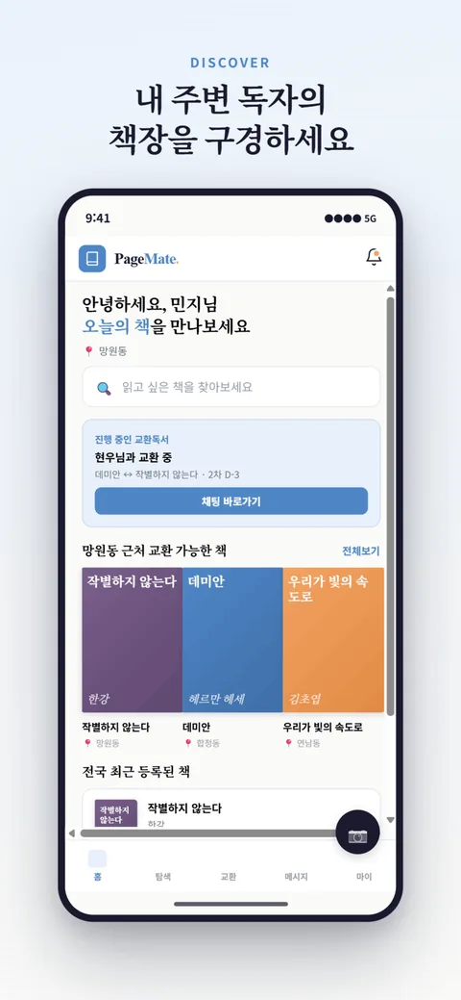
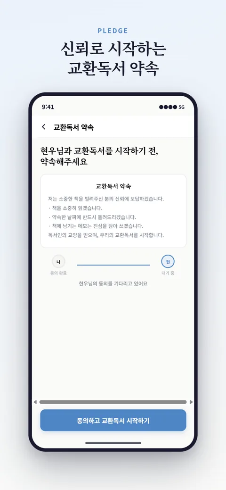
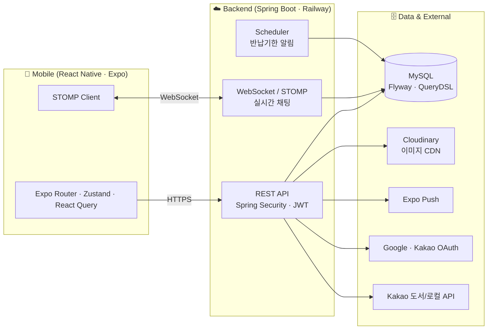

# 📖 PageMate — 교환독서 플랫폼

> **한 권의 책에 두 사람의 독서 경험이 쌓입니다.**
> 서로 책을 빌려주고, 각자 여백에 메모하며 읽고, 돌려받으며 상대의 흔적이 담긴 책을 주고받는 — "교환독서"를 연결하는 모바일 앱.

<p>
  
  
  
  
  
  
  
</p>

<p align="center">
  
  
  
</p>

---

## 1. 서비스 소개

책을 읽으며 느낀 것을 나누고 싶어도 주변에 같은 책을 읽는 사람을 찾기 어렵습니다. 독서 모임은 일정을 맞추기 번거롭고, 온라인 서평은 익명의 일방적 소통에 가깝습니다.

**PageMate**는 단 두 사람이 같은 책을 함께 읽으며 **여백을 통해 대화**하는 방식의 독서 교류를 연결합니다. 단순한 중고 맞바꿈이 아니라, **빌려주고(1차 교환) → 각자 읽으며 메모하고 → 돌려받는(2차 교환)** 대여-반납 사이클로 서로의 독서 흔적을 공유하는 것이 핵심 가치입니다.

| 구분 | 내용 |
|------|------|
| 플랫폼 | iOS / Android (React Native · Expo) |
| 배포 | 백엔드 Railway 운영, iOS App Store 심사 제출 |
| 팀 구성 | 2인 — 역할 분담은 아래 **9. 팀 & 역할** 참고 |

> **심사관/체험용 로그인**: 소셜 로그인(구글·카카오) 전용 앱이라, 앱 스토어 심사 및 데모를 위해 시드 데이터가 채워진 계정으로 즉시 로그인하는 **데모 로그인 경로**를 별도 설계했습니다.

---

## 2. 아키텍처



**도메인 주도 패키지 구조** — `auth` · `book` · `exchange` · `chat` · `notification` · `review` · `user` · `location` · `common`. 각 도메인이 Controller → Service → Repository(+QueryDSL) → Entity 로 응집.

---

## 3. 기술 스택

**Backend**
`Java 21` · `Spring Boot 3.4.5` · `Spring Security` · `Spring Data JPA` · `QueryDSL 5.1` · `MySQL` · `Flyway` · `WebSocket/STOMP` · `JWT(jjwt)` · `SpringDoc(OpenAPI)` · `JUnit5 · Mockito · H2 · JaCoCo`

**Frontend**
`React Native 0.76` · `Expo 52 (Expo Router)` · `TypeScript` · `Zustand` · `TanStack Query` · `@stomp/stompjs` · `Skia`

**Infra / External**
`Railway(BE·MySQL)` · `Cloudinary(이미지 CDN)` · `Expo Push` · `Google/Kakao OAuth` · `Kakao 도서·로컬 API` · `GitHub Actions(CI)`

---

## 4. 핵심 기능

- **소셜 로그인 + JWT** — 구글·카카오 OAuth 서버사이드 코드 교환, Access(1h)/Refresh(14d) 토큰 회전
- **도서 등록·탐색** — 카카오 도서 API 프록시 검색, 동네·장르 필터, 정렬
- **교환(대여-반납) 플로우** — 요청 → 수락 → 약속문 동의 → 일정 확정 → 1·2차 교환 → 상호평가, 다단계 상태 머신
- **실시간 채팅** — WebSocket/STOMP 1:1 채팅, 이미지 메시지, 커서 페이지네이션
- **알림** — 인앱 알림 + Expo 푸시, 반납기한(D-3/D-1/D-Day) 스케줄러 자동 발송
- **상호평가** — 교환 완료 후 별점·후기, 프로필 평균 별점
- **계정 관리** — 프로필·동네·취향 온보딩, 계정 탈퇴(soft delete)

---

## 5. 핵심 기술 의사결정 

> 각 결정의 상세 배경·트레이드오프는 **[docs/PORTFOLIO.md](docs/PORTFOLIO.md)** 에 정리했습니다.

| 결정 | 요약 | 근거 |
|------|------|------|
| **STOMP 프레임 단위 인증** | 핸드셰이크만 열고 CONNECT/SEND 프레임마다 JWT 검증 (`StompAuthChannelInterceptor`) | WebSocket은 최초 핸드셰이크 후 HTTP 필터가 개입 못 함 → 프레임 인터셉터로 인가 |
| **Expo Push 채택 (vs FCM)** | firebase-admin 제거, Expo Push로 전환 | Expo 관리형 앱에 최적, APNs 키를 EAS가 자동 관리 → 설정 복잡도↓, 성능 동일 |
| **이미지 저장소 추상화** | `ImageStorage` 인터페이스 + `CloudinaryStorage` | S3→Cloudinary 교체를 인터페이스 뒤로 격리, 프로필·채팅 이미지 공통 재사용 |
| **계정 탈퇴 = soft delete** | 행 삭제 대신 개인정보 제거 + `deleted_at`, 조회에서 제외 | 거래·채팅·리뷰가 사용자를 참조 → 무결성 보존하며 Apple 5.1.1(v) 대응 |
| **OAuth-only 심사 대응** | 키 게이팅된 데모 로그인 엔드포인트 설계 | 심사관이 소셜 계정 없이 로그인 불가 → 시드 계정 즉시 로그인 경로로 해결 |
| **위치 정책(콜드스타트)** | 반경 하드필터 대신 동네 부분일치 노출 | 초기 저밀도에서 매칭 품질 저하 방지, 밀도 기준 지역화 전환 설계 |

---

## 6. 트러블슈팅

- **EAS iOS 빌드 `fmt consteval` 실패** — `image:latest`가 Xcode 26을 당겨와 RN 0.76 번들 `fmt`와 충돌. Expo SDK에 맞는 Xcode 이미지 고정 + config plugin 패치로 해결. (App Store `90725 SDK version` 대응 포함)
- **CI 도입 중 잠복 테스트 2건 적발** — H2 테스트 스키마엔 `ON DELETE CASCADE`가 없어 teardown FK 위반, 신규 의존성 목킹 누락 NPE. CI가 없어 여태 안 걸리던 것을 파이프라인 구축으로 발견·수정.
- **데모 로그인 프로덕션 검증** — 배포 후 `401→403→200` 상태 전이를 폴링으로 확인, 실제 토큰·시드 데이터 응답까지 end-to-end 검증.

---

## 7. 프로젝트 구조

```
PageMate/
├── backend/                    # Spring Boot
│   └── src/main/java/app/pagemate/
│       ├── auth/               # OAuth · JWT
│       ├── book/               # 도서 (QueryDSL 검색)
│       ├── exchange/           # 교환 상태머신 · 반납 스케줄러
│       ├── chat/               # WebSocket/STOMP
│       ├── notification/       # 인앱 + Expo Push
│       ├── review/ user/ location/
│       └── common/             # security · config · service(ImageStorage)
│   └── src/main/resources/db/migration/   # Flyway V1~V21
├── app/                        # Expo Router 화면
├── src/                        # features · lib · store · components
└── .github/workflows/ci.yml    # CI (BE test+jacoco / FE tsc)
```

---

## 8. 실행 방법

```bash
# Backend
cd backend
./gradlew bootRun            # application-local.yml 필요 (DB·OAuth·JWT)

# Frontend
npm install
npx expo start               # .env: EXPO_PUBLIC_API_URL 등
```

CI: `push`/`PR` 시 GitHub Actions가 백엔드 테스트(H2)+커버리지, 프론트 타입체크 자동 실행.

---

## 9. 팀 & 역할

| 멤버 | 담당 |
|------|------|
| **손재이** ([@wo2ek8](https://github.com/wo2ek8)) | **백엔드·인프라·배포 주담당** — 도메인 패키지 설계, Spring Security + JWT, WebSocket/STOMP 인증, QueryDSL 동적 쿼리, Flyway 스키마 관리(21개 마이그레이션), Railway 배포, Cloudinary/Expo Push 연동, GitHub Actions CI, App Store 심사 대응(데모 로그인·SDK 이슈) + 프론트 다수 기능(온보딩, 채팅 이미지, 푸시 등록·딥링크) |
| **정우협** ([@david-jung-lab](https://github.com/david-jung-lab)) | **프론트엔드 주담당** — 화면·UX 전반(홈·마이페이지·도서 등록/상세), 소셜 로그인 클라이언트 연동, 교환-채팅 화면 연동 |

---

<sub>📎 기술 심층 문서(의사결정·트러블슈팅): <b>docs/PORTFOLIO.md</b></sub>
