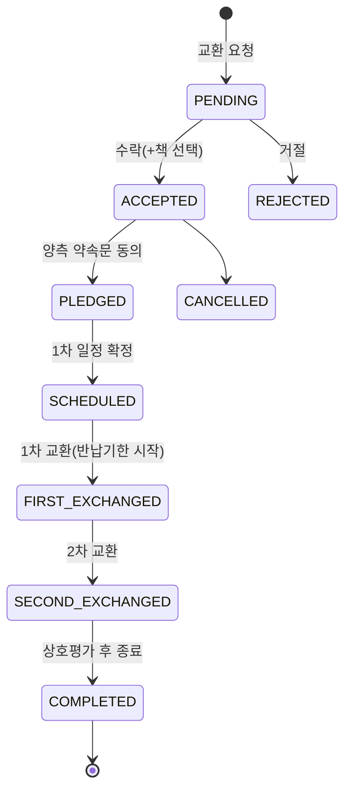

# PageMate — 기술 심층 문서

> 백엔드·인프라 관점의 핵심 의사결정과 트러블슈팅을 정리한 문서입니다. (2인 팀 / 본인: 백엔드·인프라·배포 주담당)

---

## 1. 요약

- **무엇** — "교환독서"(서로 책을 빌려주고 여백에 메모하며 읽고 돌려받는) 모바일 서비스. React Native 앱 + Spring Boot 서버.
- **어디까지** — Railway에 백엔드·MySQL 운영, iOS App Store 심사 제출까지 완주. GitHub Actions CI 구축.
- **핵심** — 단순 CRUD를 넘어 **실시간 채팅(STOMP 프레임 인증) · 다단계 교환 상태 머신 · 스케줄러 · 스토리지 추상화 · 배포/심사 대응**까지, 동작하는 제품을 끝까지 책임진 기록입니다.

| 지표 | 값 |
|------|-----|
| Flyway 마이그레이션 | 19개 |
| 교환 상태 머신 | 9개 상태 |
| 테스트 | 76개 (GitHub Actions CI + JaCoCo) |

---

## 2. 아키텍처 하이라이트

- **도메인 주도 패키지** — `auth / book / exchange / chat / notification / review / user / location / common`. 각 도메인이 Controller → Service → Repository → Entity로 응집되고, 크로스 도메인 협력은 Service 주입으로 처리.
- **읽기/쓰기 분리 성향** — 목록·검색 등 동적 쿼리는 **QueryDSL**(`BookQueryRepository`)로 타입 세이프하게, 단순 CRUD는 Spring Data JPA로.
- **스키마 진화 관리** — **Flyway 19개 마이그레이션**으로 컬럼 추가/제거·시드 데이터까지 버전 관리. 운영 DB의 재현 가능한 상태 보장.
- **STATELESS 보안** — 세션 없이 JWT + `JwtAuthFilter`, WebSocket은 별도 프레임 인터셉터로 동일한 보안 기준 유지.

---

## 3. 핵심 의사결정 & 트러블슈팅

### 3-1. WebSocket/STOMP "프레임 단위" 인증

- **배경** — 실시간 채팅을 STOMP로 구현. 그런데 HTTP `SecurityFilterChain`은 **핸드셰이크 이후의 STOMP 프레임에는 개입하지 못함** → 인증되지 않은 클라이언트가 임의의 채팅방을 구독/발신할 위험.
- **문제** — 프레임 레벨에서 사용자를 식별하고, 대화 참여자만 접근하도록 인가해야 함.
- **해결** — `ChannelInterceptor`(`StompAuthChannelInterceptor`)를 등록해 **CONNECT 프레임의 JWT를 검증**하고 `Principal`을 심음. 핸드셰이크는 `permitAll`로 열되, 실제 인가는 프레임 단위로 수행. 참여자 검증 쿼리(`existsByIdAndParticipant`)로 채팅방 접근 통제.
- **결과** — 세션리스 구조를 유지하면서 실시간 계층에도 REST와 동일한 보안 기준 적용. 인터셉터 단위 테스트 작성.

### 3-2. 교환 = "대여-반납" 상태 머신 + 반납기한 스케줄러

- **배경** — 제품의 본질이 단순 맞바꿈이 아니라 **빌려주고 → 각자 읽으며 메모하고 → 돌려받는** 사이클. 요청/수락/완료 수준의 3~4단계로는 약속·일정·반납기한을 표현할 수 없음.
- **해결** — 9개 상태의 명시적 상태 머신으로 모델링하고, 각 전이를 엔티티 메서드로 캡슐화해 불변식을 보호. 1·2차 교환은 **양측 확인(confirmed)** 이 모두 필요하도록 설계. `ExchangeDueDateScheduler`가 반납기한 **D-3 / D-1 / D-Day** 알림을 자동 발송.

- **결과** — 복잡한 도메인 규칙이 상태 머신으로 응집되어 서비스 로직 분기가 단순해지고, "돌려받기"까지의 리마인드가 자동화됨.

### 3-3. 계정 탈퇴 — soft delete로 무결성 + 스토어 정책 동시 대응

- **배경** — Apple 심사 지침 **5.1.1(v)**: 계정 생성이 가능한 앱은 앱 내 계정 삭제도 제공해야 함. 그런데 사용자 행을 물리 삭제하면 교환·채팅·리뷰 등 **다수 FK 참조가 깨짐**.
- **해결** — `deleted_at` 기반 **soft delete**: 개인정보(닉네임·이미지 등)는 즉시 제거하고, 진행 중 대여는 취소, refresh 토큰은 무효화. 도서 목록·프로필 등 조회 쿼리에서 탈퇴 사용자를 **일괄 제외**(`deletedAt.isNull()`), 토큰 재발급 시 `isDeleted` 차단.
- **결과** — 참조 무결성을 지키면서 심사 요구사항 충족. "같은 소셜 계정으로 재로그인 시 신규 계정 생성" 정책까지 정의.

### 3-4. 푸시 — Expo Push 채택 (vs Firebase FCM)

- **배경** — 초기엔 `firebase-admin` 의존성이 존재. 하지만 Expo 관리형 앱에서 FCM 직접 발송은 **Firebase 프로젝트·서비스 계정·APNs 키의 수동 설정** 부담이 큼.
- **해결** — 트레이드오프(전송 성능은 동등, 대규모/토픽 발송은 FCM 우위)를 비교한 뒤 현 단계에서는 **Expo Push**로 결정. `firebase-admin`을 제거하고, `@Async` 발송 컴포넌트로 요청 스레드/트랜잭션과 분리해 발송 실패가 인앱 알림에 영향을 주지 않도록 격리.
- **결과** — APNs 키를 EAS가 자동 관리해 설정 복잡도 대폭 감소. 발송은 인앱 알림 저장 후 비동기로 수행하며, 사용자 알림 on/off·미등록 토큰을 방어적으로 처리.

### 3-5. 이미지 스토리지 추상화 (S3 → Cloudinary)

- **해결** — `ImageStorage` 인터페이스 뒤로 구현을 격리하고 `CloudinaryStorage`로 교체. 자격증명 미설정 시 **no-op(null 반환)** 으로 앱이 죽지 않게 방어. 프로필·채팅 이미지가 동일 추상화를 재사용.
- **결과** — 벤더 교체 비용을 인터페이스 경계로 최소화(추후 R2 등 전환 시에도 구현체만 교체). 실제 업로드→CDN URL 반환을 운영 환경에서 검증.

### 3-6. CI 구축이 잡아낸 잠복 버그

- **배경** — CI가 없어 테스트가 통과 상태인 줄 알았지만, 파이프라인 도입을 위해 전체 실행하니 **2건 실패**.
- **해결** — ① 신규 의존성(`ExpoPushClient`) 목킹 누락으로 인한 NPE → 목 추가. ② H2 테스트 스키마에는 `ON DELETE CASCADE`가 없어 teardown 시 FK 위반 → 자식 행부터 순서 삭제. GitHub Actions(백엔드 테스트 + **JaCoCo**, 프론트 `tsc`) 구성.
- **결과** — 76개 테스트 green, 라인 커버리지 측정 체계 확보. "CI 부재 → 잠복 실패"를 구조적으로 차단.

### 3-7. OAuth 전용 앱의 심사/데모 로그인 설계

- **배경** — 소셜 로그인(구글·카카오) 전용이라 **심사관이 로그인할 방법이 없음**(외부 소셜 계정 필요).
- **해결** — 시드 데이터가 채워진 데모 계정으로 즉시 로그인하는 엔드포인트를 설계하되, 공개 노출을 막기 위해 **enable 플래그 + 사전 공유 키(`X-Demo-Key`, 상수 시간 비교)** 로 게이팅. 심사 후 즉시 닫을 수 있도록 설정 분리.
- **결과** — 배포 후 `401→403→200` 상태 전이를 폴링으로 확인하고 실제 토큰·시드 응답까지 검증. 재빌드 없이 심사용 로그인 경로 확보.

---

## 4. JWT 인증 흐름

- **Access(1h) / Refresh(14d)** 이중 토큰. Refresh는 서버가 보관·검증 후 **회전(rotation)** — 탈취된 토큰의 재사용을 차단.
- 클라이언트는 401 응답 시 인터셉터가 자동 재발급 → 원요청 재시도, 재발급 실패 시 로그아웃 처리.
- 계정 탈퇴·로그아웃 시 refresh 토큰 무효화로 세션 종료를 서버에서 보장.

---

## 5. 한계와 개선 계획

현재 상태를 정확히 알고 있는 것 또한 설계의 일부라고 생각합니다.

- **테스트 커버리지** — 라인 커버리지 57% → 도메인 서비스 중심으로 70%대까지 보강 예정
- **쿼리 최적화** — 목록 API의 카운트 쿼리 분리, 페치 조인 튜닝 여지
- **동시성** — 교환 상태 전이에 낙관적 락 도입 검토 (현재는 트랜잭션 경계 + 엔티티 캡슐화로 방어)
- **관측성** — 구조화 로깅·메트릭 수집, 부하 테스트

---

서비스 소개·아키텍처 다이어그램·프로젝트 구조는 <b><a href="../README.md">README.md</a></b> 참고.
