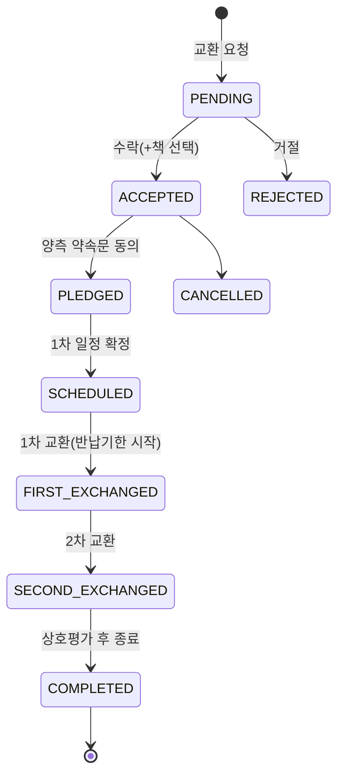

# PageMate — 기술 심층 & 면접 대비

> 백엔드·인프라 관점의 의사결정, 트러블슈팅, 예상 질문 정리. (2인 팀 / 본인: 백엔드·인프라·배포 주담)

---

## 0. 30초 요약

- **무엇** — "교환독서"(서로 책을 빌려주고 여백에 메모하며 읽고 돌려받는) 모바일 서비스. React Native 앱 + Spring Boot 서버.
- **어디까지** — Railway에 백엔드·MySQL 운영, iOS App Store **심사 제출**까지 완주. GitHub Actions CI 구축.
- **강조점** — 단순 CRUD가 아니라 **실시간 채팅(STOMP 인증)·다단계 교환 상태머신·스케줄러·스토리지 추상화·배포/심사 대응**까지, "돌아가는 제품"을 끝까지 책임진 경험.

---

## 1. 아키텍처 하이라이트

- **도메인 주도 패키지** — `auth/book/exchange/chat/notification/review/user/location/common`. 각 도메인 Controller→Service→Repository→Entity 응집, 크로스 도메인은 Service 주입으로 협력.
- **읽기/쓰기 분리 성향** — 목록·검색 등 동적 쿼리는 **QueryDSL**(`BookQueryRepository`)로 타입 세이프하게, 단순 CRUD는 Spring Data JPA.
- **스키마 진화 관리** — **Flyway 19개 마이그레이션**으로 컬럼 추가/제거·시드까지 버전 관리. 운영 DB에 재현 가능한 상태 보장.
- **STATELESS 보안** — 세션 없이 JWT + `JwtAuthFilter`, WebSocket은 별도 프레임 인터셉터.

---

## 2. 핵심 의사결정 & 트러블슈팅 (STAR)

### 2-1. WebSocket/STOMP "프레임 단위" 인증
- **상황(S)** — 실시간 채팅을 STOMP로 구현. 그런데 HTTP `SecurityFilterChain`은 **핸드셰이크 이후 프레임에는 개입하지 못함** → 인증되지 않은 클라이언트가 아무 채팅방이나 구독/발신할 위험.
- **과제(T)** — 프레임 레벨에서 사용자를 식별하고, 참여자만 접근하도록 인가.
- **행동(A)** — `ChannelInterceptor`(`StompAuthChannelInterceptor`)를 등록해 **CONNECT 프레임의 JWT를 검증**하고 `Principal`을 심음. 핸드셰이크는 `permitAll`, 실제 인가는 프레임 단위로 수행. 참여자 검증 쿼리(`existsByIdAndParticipant`)로 방 접근 통제.
- **결과(R)** — 세션리스 구조를 유지하면서 실시간 계층에도 REST와 동일한 보안 기준 적용. 관련 인터셉터 단위 테스트 작성.

### 2-2. 교환 = "대여-반납" 상태 머신 + 반납기한 스케줄러
- **상황(S)** — 제품 본질이 단순 맞바꿈이 아니라 **빌려주고 → 각자 읽으며 메모 → 돌려받는** 사이클. 상태가 요청/수락/완료 4단계로는 표현 불가.
- **행동(A)** — 9개 상태의 명시적 머신으로 모델링하고, 각 전이를 엔티티 메서드로 캡슐화(불변식 보호). 1·2차 교환은 **양측 confirmed** 필요. `ExchangeDueDateScheduler`가 반납기한 **D-3/D-1/D-Day** 알림을 자동 발송.

- **결과(R)** — 복잡한 도메인 규칙을 상태 머신으로 응집해 서비스 로직 분기를 단순화하고, 스케줄러로 "돌려받기"까지 자동 리마인드.

### 2-3. 계정 탈퇴 — soft delete로 무결성 + 스토어 정책 동시 대응
- **상황(S)** — Apple 심사 지침 **5.1.1(v)**: 계정 생성이 되면 앱 내 삭제도 제공해야 함. 그런데 사용자 행을 물리 삭제하면 교환·채팅·리뷰 등 **다수 FK가 깨짐**.
- **행동(A)** — `deleted_at` 기반 **soft delete**: 개인정보(닉네임·이미지 등) 제거 + 진행 중 대여 취소 + refresh 토큰 무효화. 도서 목록·프로필 조회 쿼리에서 탈퇴 사용자를 **일괄 제외**(`deletedAt.isNull()`), refresh 시 `isDeleted` 차단.
- **결과(R)** — 참조 무결성을 지키면서 심사 요구사항 충족. "같은 소셜 계정으로 재로그인 시 신규 계정 생성" 정책까지 정의.

### 2-4. 푸시 — Expo Push 채택 (vs Firebase FCM)
- **상황(S)** — 초기엔 `firebase-admin` 의존성 존재. 하지만 Expo 관리형 앱에서 FCM 직접 발송은 **Firebase 프로젝트·서비스계정·APNs 키 수동 설정** 부담이 큼.
- **행동(A)** — 트레이드오프(성능은 동일, 대규모/토픽 발송은 FCM 우위)를 비교한 뒤, 현 단계엔 **Expo Push**로 결정. `firebase-admin` 제거, `@Async` 발송 컴포넌트로 요청 스레드/트랜잭션과 분리, 실패해도 인앱 알림엔 영향 없도록 격리.
- **결과(R)** — APNs 키를 EAS가 자동 관리 → 설정 복잡도 대폭 감소. 발송은 인앱 알림 저장 후 비동기로 수행, 사용자 알림 on/off·미등록 토큰을 방어적으로 처리.

### 2-5. 이미지 스토리지 추상화 (S3 → Cloudinary)
- **행동(A)** — `ImageStorage` 인터페이스 뒤로 구현을 격리하고 `CloudinaryStorage`로 교체. 자격증명 미설정 시 **no-op(null 반환)**으로 앱이 죽지 않게 방어. 프로필·채팅 이미지가 동일 추상화를 재사용.
- **결과(R)** — 벤더 교체 비용을 인터페이스 경계로 최소화(추후 R2 등 전환도 발송부만 교체). 실제 업로드→CDN URL 반환을 라이브로 검증.

### 2-6. CI 구축이 잡아낸 잠복 버그
- **상황(S)** — CI가 없어 테스트가 "초록인 줄" 알았지만, 파이프라인 도입 위해 전체 실행하니 **2건 실패**.
- **행동(A)** — ① 신규 의존성(`ExpoPushClient`) 목킹 누락 NPE → 목 추가, ② H2 테스트 스키마엔 `ON DELETE CASCADE`가 없어 teardown FK 위반 → 자식 행부터 순서 삭제. GitHub Actions(BE test+**JaCoCo**, FE `tsc`) 구성.
- **결과(R)** — 76개 테스트 green, 라인 커버리지 측정 체계 확보. "CI 부재 → 잠복 실패" 문제를 구조적으로 차단.

### 2-7. OAuth-only 앱의 심사/데모 로그인 설계
- **상황(S)** — 소셜 로그인(구글·카카오) 전용이라 **심사관이 로그인할 방법이 없음**(외부 계정 필요).
- **행동(A)** — 시드 데이터가 채워진 데모 계정으로 즉시 로그인하는 엔드포인트를 설계하되, 공개 노출을 막기 위해 **enable 플래그 + 사전 공유 키(`X-Demo-Key`, 상수시간 비교)** 로 게이팅. 심사 통과 후 즉시 닫도록 설정 분리.
- **결과(R)** — 배포 후 `401→403→200` 상태 전이를 폴링으로 확인, 실제 토큰·시드 응답까지 검증. 재빌드 없이 심사 로그인 경로를 살림.

---

## 3. 예상 면접 질문 & 답변 포인트

- **JWT 재발급 흐름은?** → Access(1h)/Refresh(14d), 서버가 refresh 토큰 보관·검증 후 회전. 클라이언트는 401 시 인터셉터가 자동 재발급→원요청 재시도, 실패 시 로그아웃.
- **WebSocket 인증을 어떻게?** → 핸드셰이크 permitAll + `ChannelInterceptor`에서 CONNECT 프레임 JWT 검증. HTTP 필터가 프레임에 개입 못 하는 한계를 프레임 인터셉터로 보완.
- **N+1 / 쿼리 최적화는?** → 동적 검색은 QueryDSL로 필요한 조건만 조립, 목록 정렬·필터를 쿼리 레벨에서 처리. (개선 여지: 카운트 쿼리 분리·페치 조인 튜닝)
- **동시성/정합성은?** → 교환 상태 전이를 엔티티 메서드로 캡슐화해 불변식 보호, 트랜잭션 경계 안에서 상태 변경. (확장: 상태 전이 낙관적 락 고려)
- **왜 Cloudinary/Expo Push?** → 위 2-4·2-5의 트레이드오프로 답변. 핵심은 "현 단계 복잡도 대비 이득"과 "교체 가능한 경계 설계".
- **테스트 전략은?** → 서비스는 Mockito 단위, 컨트롤러/보안은 @SpringBootTest(H2)로 통합. JaCoCo로 커버리지 가시화, CI로 회귀 방지.

**개선 로드맵(솔직하게 말할 것)** — 커버리지 70%까지 보강 / 카운트 쿼리·페치 조인 최적화 / 상태 전이 동시성 방어 / 관측성(로그·메트릭) / 부하 테스트.

---

## 4. 이력서 문구 (복붙용)

**한 줄 요약**
> PageMate — 실시간 채팅·대여반납 교환 플로우를 갖춘 교환독서 앱. Spring Boot 백엔드·인프라·배포 주담(2인), App Store 심사 제출까지 완주.

**상세 bullet**
- Spring Boot·MySQL 기반 백엔드를 **도메인 주도 구조**로 설계하고 9개 도메인의 API·인증·스키마(Flyway 19개 마이그레이션)를 구축
- **WebSocket/STOMP 실시간 채팅**을 프레임 단위 JWT 인증(ChannelInterceptor)으로 구현해 세션리스 보안 유지
- **9개 상태의 교환(대여-반납) 상태 머신**과 반납기한 스케줄러(D-3/D-1/D-Day 알림)로 복잡한 도메인 규칙을 응집
- 계정 탈퇴를 **soft delete**로 설계해 참조 무결성 보존 + Apple 심사 지침(5.1.1v) 대응
- **Expo Push·Cloudinary**를 인터페이스 경계로 도입(FCM/S3 대비 트레이드오프 분석), 벤더 교체 비용 최소화
- **GitHub Actions CI**(테스트+JaCoCo, 타입체크) 구축 과정에서 잠복 테스트 실패 2건을 적발·수정, 76 테스트 green화
- 소셜 로그인 전용 앱의 **App Store 심사 대응**(키 게이팅 데모 로그인, Xcode/SDK 빌드 이슈 해결)을 주도하고 Railway 배포·검증까지 완료

---

메인 소개는 <b>../README.md</b> 참고.
